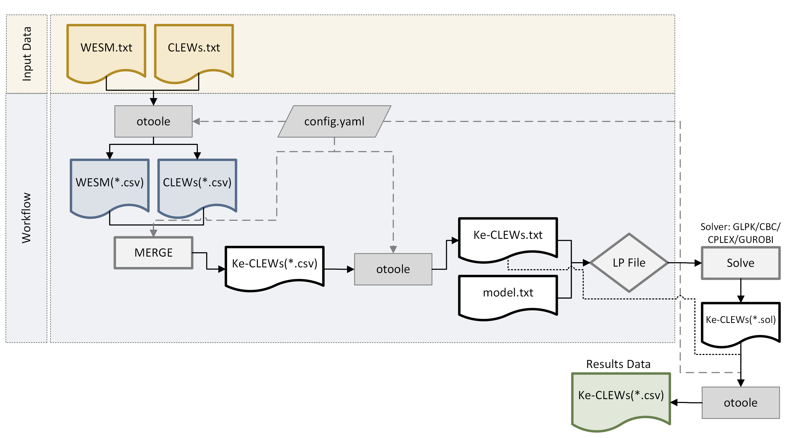

# CLEWs-Kenya
This repository presents a workflow using open-source energy models explicitly developed for Kenya. The first model is the [Whole Energy System for Kenya (WESM)](https://github.com/ClimateCompatibleGrowth/osemosys_kenya), encompassing power generation, industrial, and transportation sectors, among others. The second model is a Climate, Land, Energy, and Water system [(CLEWs)](https://github.com/robertodawid/Kenya_Clews/tree/main) model, focusing on intricate interdependencies between the energy and land systems within the Kenyan context. The CLEWs model presents the interlinkages evident in sectors such as cooking (representing energy) and agriculture (representing land). While both models address aspects of the energy system, the CLEWs model uniquely integrates additional dimensions such as land and water systems.
Merging these models has the potential to capture additional interactions between various systems. For instance, the utilization of fossil fuels extends beyond energy generation to activities in the land and water domains, including mechanization and pumping, respectively. Similarly, electricity finds application in residential settings for irrigation and public water distribution, showcasing interdependencies across sectors.


*Figure 1. Merging WESM-CLEWs workflow*

Figure 3 provides an overview of the process involved in merging both models. The units in both models are similar; for example, technology costs are given in millions of dollars per gigawatt (MM⁄GW). Fuel costs are given in millions of dollars per petajoule (MM⁄PJ). Once both models are in *.CSV format, the _snakemake_ file attached is used to:
* Read the common technologies (tech) and fuels. Table 1 shows the common tech and fuel found in both models. 
* Update the technology and fuel names in the CLEWs model. For instance, change the fuel name 'ELC' in the CLEWs model to 'ELC003,' which is the electricity provided after transmission and distribution in the WESM.
* Delete repeated common technologies: IMPDSL, IMPELC, IMPKER, IMPLPG in the CLEWs model.
* Update the Region name from the CLEWs model ('RE1') to the name in the WESM ('KENYA').
* Update the units of emission activity ratio in the merged model to kilotons of CO2 per petajoule (kTon⁄PJ)
* Remove common techs from the CLEWs model. This also applies to removing repeated technologies in the Sets: TECHNOLOGY and FUEL.
* Merge the two models
* Save the merged model as *.csv format.
To print the files, the configuration file *.YAML file must be configured. The configuration file also uses 'otoole convert' commands to print results.

# To run the workflow

1. Both data input files as *.txt.
2. Convert both input data files from *.txt to *.csv, for example:
```
otoole convert datafile csv ./Ke_CLEWs-kth/data.txt ./csv config.yaml
```
2. Run the code
```
snakemake -s snakefile_merge --core 1
```
3. After running the workflow, the output is an LP file. The LP file can be solved using GLPK, CPLEX, GUROBI, or CBC solvers. Then, the SOL file can be converted to a CSV or Excel file using the Otoole package. Additional examples in [Otoole](https://otoole.readthedocs.io/en/latest/examples.html)
## Funding
This material has been produced with support from the Climate Compatible Growth Programme (CCG) programme. CCG is funded by UK aid from the UK government. However, the views expressed herein do not necessarily reflect the UK government's official policies.
